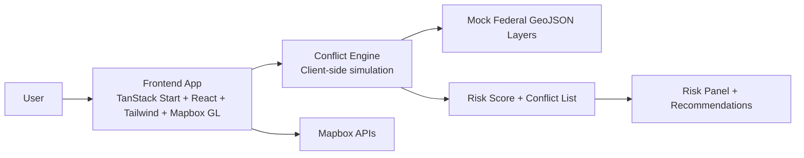
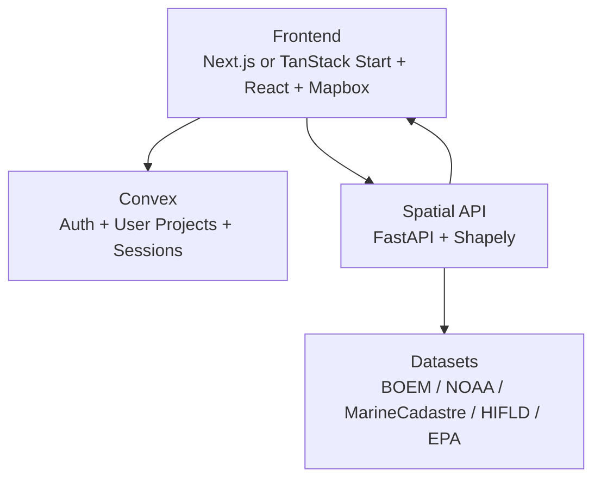

# ReGrid

**Spatial Intelligence for the Clean Energy Transition**

ReGrid is an interactive siting intelligence platform for clean energy developers. Users can place a candidate project footprint (circle, square, hexagon), run spatial conflict analysis against federal-style layers, and get an optimization recommendation that relocates the site to a lower-risk area.

The product experience is a full-screen dark map interface with glassmorphism controls, real-time layer toggles, and animated risk analytics designed to feel enterprise-grade and demo-ready.

## Demo Flow

1. **Explore** - Navigate a full-screen dark map and toggle infrastructure and risk layers.
2. **Propose** - Choose a shape tool, click the map, and place a project footprint.
3. **Analyze** - Run conflict scoring to compute a 0-100 siting risk score.
4. **Optimize** - Trigger AI Auto-Relocate to search nearby alternatives and animate to a better site.

## Product Architecture



## System Design (Target Production Stack)



## How Project Shapes Work

Each project footprint is represented as GeoJSON and rendered with a semi-transparent fill and dashed border on the map. The app supports:

- **Circle** - regular polygon approximation
- **Square** - 4-sided polygon with rotation to align edges
- **Hexagon** - 6-sided polygon

Generalized regular-polygon generation:

```text
for i in 0..sides:
    angle = (i / sides) * 2pi + rotation
    dLat  = (radiusKm / 6371) * cos(angle)
    dLng  = (radiusKm / 6371) * sin(angle) / cos(lat)
    point = [lng + dLng, lat + dLat]
```

## Conflict and Optimization Logic

Current implementation simulates conflict analysis in-app:

- Layer overlap/proximity weighting per active dataset
- Risk scoring from 0-100 with severity bands
- Conflict list generation for the right-side Risk Panel
- AI Auto-Relocate simulation that searches nearby coordinates and returns a better score

Target production engine (FastAPI + Shapely):

- Polygon intersection checks (`intersects`)
- Buffered proximity checks (`buffer`)
- Area/distance weighted risk model
- Relocation grid search and ranked recommendations

## APIs and Integrations Needed

To move from demo simulation to production-grade spatial intelligence, these APIs/services are needed:

### 1) Map and Geocoding
- **Mapbox Access Token** (`NEXT_PUBLIC_MAPBOX_TOKEN`)
- Optional: Mapbox Geocoding API (search, reverse geocode, place labels)

### 2) Auth and User Data
- **Convex Deployment URL** (`NEXT_PUBLIC_CONVEX_URL`)
- Convex auth provider configuration (email/password or OAuth)
- Convex tables/functions for saved projects, analysis history, and user settings

### 3) Spatial Analysis Service
- **FastAPI service URL** (example: `NEXT_PUBLIC_SPATIAL_API_URL`)
- Endpoints:
  - `GET /health` - service and dataset readiness
  - `GET /api/layers` - GeoJSON layers for rendering
  - `POST /api/conflict-check` - risk score + conflicts + recommendation
  - `POST /api/optimize` (optional split endpoint) - best-site search

### 4) Federal/Infrastructure Data Feeds
- BOEM lease polygons
- NOAA / marine protection boundaries
- MarineCadastre shipping corridors
- HIFLD/EIA infrastructure layers
- EPA EJScreen polygons

### 5) Optional Production Enhancements
- Caching layer (Redis/Valkey) for repeated spatial queries
- Queue/workers for heavy geoprocessing jobs
- Object storage for versioned GeoJSON snapshots
- Observability (Sentry + logs + traces)

## Environment Variables

```bash
# Required now
NEXT_PUBLIC_MAPBOX_TOKEN=...

# Required when Convex is connected
NEXT_PUBLIC_CONVEX_URL=...

# Recommended when external spatial API is enabled
NEXT_PUBLIC_SPATIAL_API_URL=http://localhost:8000
```

## Local Development

```bash
bun install
bun run dev
```

Open the app, provide a Mapbox token in the token gate, then:
- Toggle layers in the left panel
- Place a shape on map click
- Analyze risk
- Auto-relocate for optimized siting

## Current Status

- UI and interaction model are implemented and polished.
- Conflict analysis is currently simulated client-side for demo speed.
- Convex/FastAPI/data pipeline integration is the next milestone.

